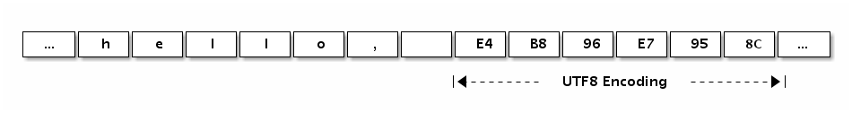
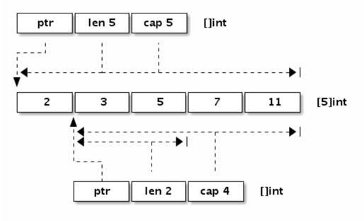
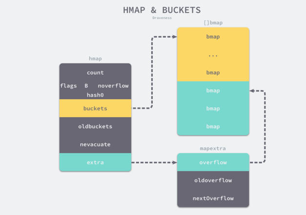
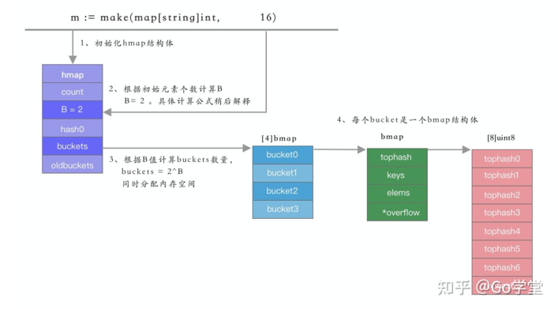
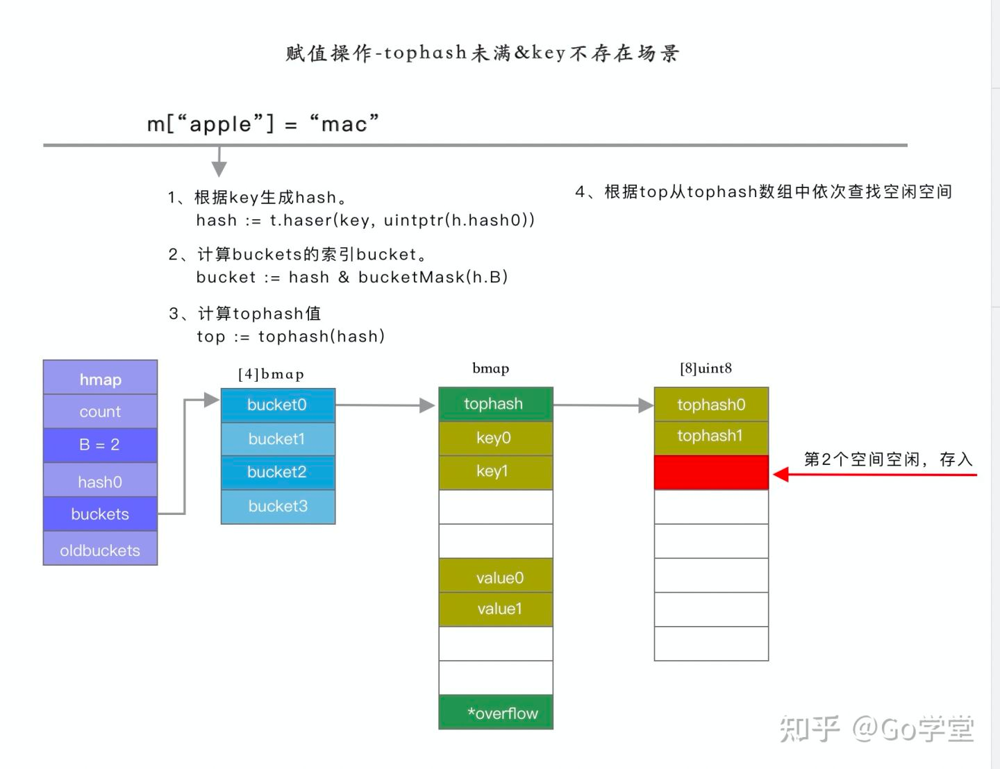
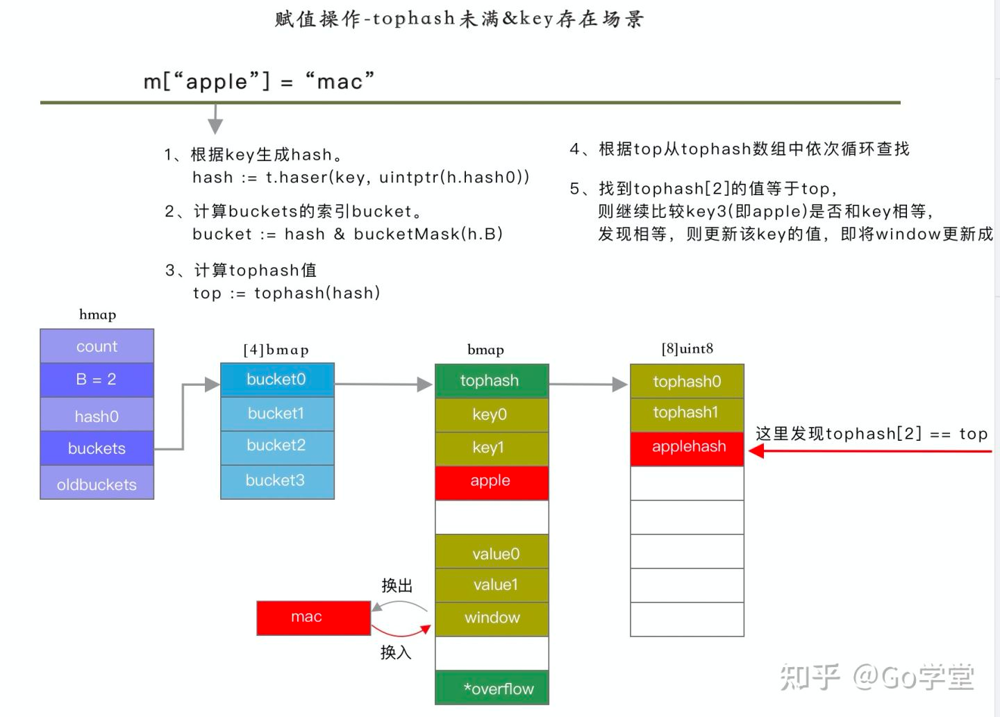
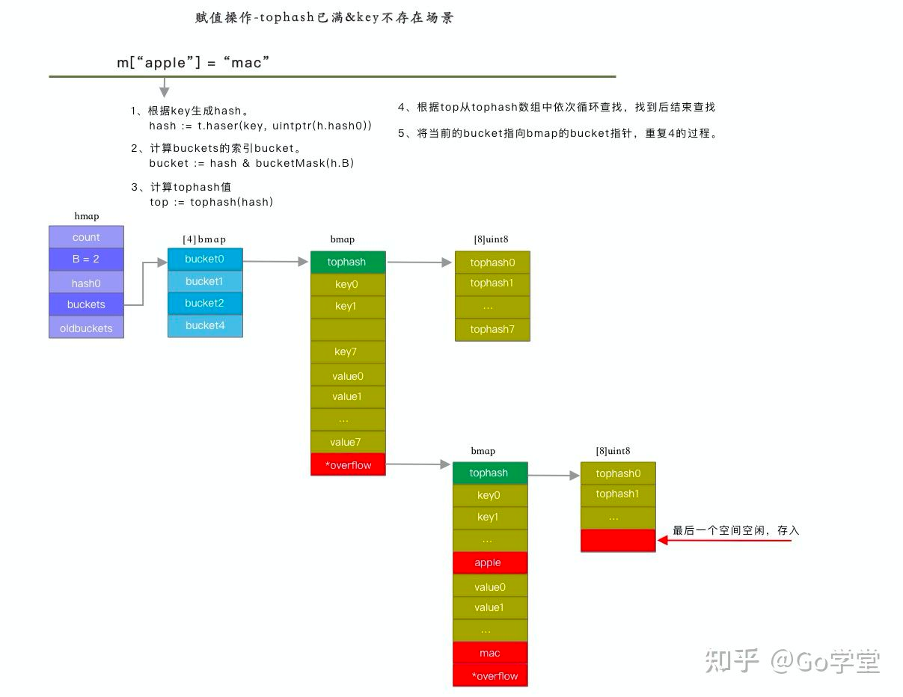
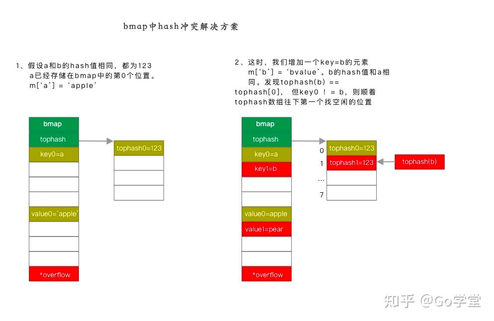

## 数组、字符串、切片
在go中，数组、字符串和切片在内存结构上是相同的，但上层语法的限制导致了不同的行为表现。

- Go的数组是一种值类型，虽然数组的元素可以被修改，但是数组本身的赋值和函数传参都是通过整体复制的方式处理的。
- Go的字符串底层数据对应的也是字节数组，但是字符串的只读属性禁止了程序中对底层字节数组的元素的修改。**字符串的赋值只是复制了数据地址和对应的长度，而不会导致底层的复制**
- Go的切片的结构和字符串类似，但是解除了只读限制。并且有长度和容量信息，切片赋值和函数传参的也是将切片头部信息按值传递，因为切片头有底层数据的指针，所以它的赋值也不会导致底层数据的赋值。

## 1.1 数组
#### 定义方式
```
var a [3]int                    // 定义长度为3的int型数组, 元素全部为0
var b = [...]int{1, 2, 3}       // 定义长度为3的int型数组, 元素为 1, 2, 3
var c = [...]int{2: 3, 1: 2}    // 定义长度为3的int型数组, 当出现 "a : b "的时候，a表示索引，b表示值，未表示的地方自动赋0元素为 0, 2, 3
var d = [...]int{1, 2, 4: 5, 6} // 定义长度为6的int型数组, 下标4的元素为5，后续跟着下标4赋值，所以元素为 1, 2, 0, 0, 5, 6
// var b = [...]int{5: 1, 2: 2, 2, 3, 4} // 错误的赋值方式，因为下标2往后的第三个数据，也就是下标5的位置，在前面已经赋值过
```
#### 内存分布
GoGo语言中数组是值语义。一个数组变量即表示整个数组，它并不是隐式的指向第一个元素的指针（比如C语言的数组），而是一个完整的值。当一个数组被赋值时，实际上会复制整个数组，如果数组较大的话，数组的赋值也会有较大的开销。为了避免复制数组带来的开销，**可以传递一个指向数组的指针，但是数组指针并不是数组。**

初始化时，如果数组的元素数量小于或等于4，会直接将数组的元素放在栈上；如果元素大于4时，会将数组的元素放置到静态区并在运行时取出。

#### 遍历方式
```
    for i := range a {
        fmt.Printf("a[%d]: %d\n", i, a[i])
    }
    for i, v := range b {
        fmt.Printf("b[%d]: %d\n", i, v)
    }
    for i := 0; i < len(c); i++ {
        fmt.Printf("c[%d]: %d\n", i, c[i])
    }
```
#### 内存大小
下面这个数组虽然长度为5（二维数组，``len(times[0])``为0），但是占用的内存大小依旧为0

```
var times [5][0]int
fmt.Println(len(times))             // 打印5
fmt.Println(unsafe.Sizeof(times))   // 打印 0
```

#### 打印
我们可以用``fmt.Printf``函数提供的``%T``或``%#v``谓词语法来打印数组的类型和详细信息：
```
    fmt.Printf("b: %T\n", b)  // b: [3]int
    fmt.Printf("b: %#v\n", b) // b: [3]int{1, 2, 3}
```

#### 其他
长度为0的数组在内存中并不占用空间。空数组虽然很少直接使用，但是可以用于强调某种特有类型的操作时避免分配额外的内存空间，比如用于管道的同步操作：
```
    c1 := make(chan [0]int)
    go func() {
        fmt.Println("c1")
        c1 <- [0]int{}
    }()
    <-c1
```
在这里，我们并不关心管道中传输数据的真实类型，其中管道接收和发送操作只是用于消息的同步。对于这种场景，我们用空数组来作为管道类型可以减少管道元素赋值时的开销。当然一般更倾向于用无类型的匿名结构体代替：

```
    c2 := make(chan struct{})
    go func() {
        fmt.Println("c2")
        c2 <- struct{}{} // struct{}部分是类型, {}表示对应的结构体值
    }()
    <-c2
```


# 1.2 字符串
Go语言字符串的底层结构在``reflect.StringHeader中定义``：
```
type StringHeader struct {
    Data uintptr
    Len  int
}
```
第一个是字符串指向的底层字节数组，第二个是字符串的字节的长度。
字符串其实是一个结构体，因此字符串的赋值操作也就是``reflect.StringHeader``结构体的复制过程，并不会涉及到底层字节数组的复制。

#### 字符串的切片操作
字符串不是切片，但是支持切片操作。不同位置的切片底层也访问的同一块内存数据（因为字符串是只读的，相同的字符串面值常量通常对应的同一个字符串常量）

```
s := "hello, world"
hello := s[:5]
world := s[7:]

s1 := "hello, world"[:5]
s2 := "hello, world"[7:]
```

#### 字符串编码
根据Go语言规范，Go语言的源文件都是采用UTF8编码。因此，Go源文件中出现的字符串面值常量一般也是UTF8编码的（对于转义字符，则没有这个限制）

一般都会假设字符串对应的是一个合法的UTF8编码的字符序列。可以用内置的print调试函数或fmt.Print函数直接打印，也可以用for range循环直接遍历UTF8解码后的Unicode码点值。

下面的“Hello, 世界”字符串中包含了中文字符，可以通过打印转型为字节类型来查看字符底层对应的数据：
```
fmt.Printf("%#v\n", []byte("Hello, 世界"))
// 输出： []byte{0x48, 0x65, 0x6c, 0x6c, 0x6f, 0x2c, 0x20, 0xe4, 0xb8, 0x96, 0xe7, \
0x95, 0x8c}
```
对应的内存布局：


#### 遍历原始字节码
可以将字符串强制转为[]byte字节序列后再行遍历（这里的转换一般不会产生运行时开销）：
```
for i, c := range []byte("世界abc") {
    fmt.Println(i, c)
}
```

#### 模拟不同类型的转换
**[]byte(s)转换模拟实现**
```
func str2bytes(s string) []byte {
    p := make([]byte, len(s))
    for i := 0; i < len(s); i++ {
        c := s[i]
        p[i] = c
    }
    return p
}
```

**string(bytes)转换模拟实现**
```
func bytes2str(s []byte) (p string) {
    data := make([]byte, len(s))
    for i, c := range s {
        data[i] = c
    }

    hdr := (*reflect.StringHeader)(unsafe.Pointer(&p))
    hdr.Data = uintptr(unsafe.Pointer(&data[0]))
    hdr.Len = len(s)

    return p
}
```

# 1.3 切片（slice）
切片可以理解为一种简化版的动态数组。

我们先看看切片的结构定义，``reflect.SliceHeader``：
```
type SliceHeader struct {
    Data uintptr
    Len  int
    Cap  int
}
```
可以看出切片的开头部分和Go字符串是一样的，但是切片多了一个Cap成员表示切片指向的内存空间的最大容量（对应元素的个数，而不是字节数）。下图是``x := []int{2,3,5,7,11}``和``y := x[1:3]``两个切片对应的内存结构。


#### 切片的定义方式

```
var (
    a []int               // nil切片, 和 nil 相等, 一般用来表示一个不存在的切片
    b = []int{}           // 空切片, 和 nil 不相等, 一般用来表示一个空的集合
    c = []int{1, 2, 3}    // 有3个元素的切片, len和cap都为3
    d = c[:2]             // 有2个元素的切片, len为2, cap为3
    e = c[0:2:cap(c)]     // 有2个元素的切片, len为2, cap为3
    f = c[:0]             // 有0个元素的切片, len为0, cap为3
    g = make([]int, 3)    // 有3个元素的切片, len和cap都为3
    h = make([]int, 2, 3) // 有2个元素的切片, len为2, cap为3
    i = make([]int, 0, 3) // 有0个元素的切片, len为0, cap为3
)
```
和数组一样，内置的``len``返回切片中的有效元素的长度，内置的``cap``返回切片容量大小，容量必须大于等于切片的长度。**当切片底层数据指针为空时，切片本身才为nil**，这时候的长度和容量信息都是无效的。
如果有切片的底层数据指针为空，但是长度和容量不为0的情况，那么说明切片本身已经被损坏了（比如通过``reflect.SliceHeader``或者``unsafe``包对切片进行了不正确的修改）

#### 遍历方式
```    for i := range a {
        fmt.Printf("a[%d]: %d\n", i, a[i])
    }
    for i, v := range b {
        fmt.Printf("b[%d]: %d\n", i, v)
    }
    for i := 0; i < len(c); i++ {
        fmt.Printf("c[%d]: %d\n", i, c[i])
    }
```

- 在对切片本身赋值或者传递参数时，只复制切片头信息，并不会复制底层的数据。

#### 添加切片元素
1. 在尾部追加N个元素
```
var a []int
a = append(a, 1)               // 追加1个元素
a = append(a, 1, 2, 3)         // 追加多个元素, 手写解包方式
a = append(a, []int{1,2,3}...) // 追加一个切片, 切片需要解包
```
在容量不足的情况下，会发生重新分配内存。即使容量够，依然需要使用``append``函数的返回值来更新切片本身，因为新切片的长度已经发生变化。
2. 在切片的开头添加元素
```
var a = []int{1,2,3}
a = append([]int{0}, a...)        // 在开头添加1个元素
a = append([]int{-3,-2,-1}, a...) // 在开头添加1个切片
```
在开头添加元素一般都会导致内存的重新分配，并且导致已有元素全部复制一次。
3. append支持链式操作
```
var a []int
a = append(a[:i], append([]int{x}, a[i:]...)...)     // 在第i个位置插入x
a = append(a[:i], append([]int{1,2,3}, a[i:]...)...) // 在第i个位置插入切片
```
调用的过程中，会创建一个临时切片，把``a[i:]``复制过去，然后把整个临时切片，复制到原切片中

利用``copy``和``append``可以避免中间切片的创建，同样完成添加元素的操作
```
a = append(a, 0)     // 切片扩展1个空间
copy(a[i+1:], a[i:]) // a[i:]向后移动1个位置
a[i] = x             // 设置新添加的元素
// 添加多个元素
a = append(a, x...)       // 为x切片扩展足够的空间
copy(a[i+len(x):], a[i:]) // a[i:]向后移动len(x)个位置
copy(a[i:], x)            // 复制新添加的切片
```

#### 扩容方式
当向切片中添加元素的时候，会判断扩容后的长度，是否小于等于当前容量，来判断是否进行扩容：
```
slice = append(slice, 1, 2, 3)
a := &slice
ptr, len, cap := slice
newlen := len + 3
if uint(newlen) > uint(cap) {
   newptr, len, newcap = growslice(slice, newlen)
   vardef(a)
   *a.cap = newcap
   *a.ptr = newptr
}
newlen = len + 3
*a.len = newlen
*(ptr+len) = 1
*(ptr+len+1) = 2
*(ptr+len+2) = 3
```
扩容时，在分配内存空间前需要先确定新的切片容量，运行时根据切片的当前容量选择不同的策略进行扩容：

1. 如果期望容量大于当前容量的两倍就会使用期望容量；
2. 如果当前切片的长度小于 1024 就会将容量翻倍；
3. 如果当前切片的长度大于 1024 就会每次增加 25% 的容量，直到新容量大于期望容量；

代码如下：
```
func growslice(et *_type, old slice, cap int) slice {
	newcap := old.cap
	doublecap := newcap + newcap
	if cap > doublecap {
		newcap = cap
	} else {
		if old.len < 1024 {
			newcap = doublecap
		} else {
			for 0 < newcap && newcap < cap {
				newcap += newcap / 4
			}
			if newcap <= 0 {
				newcap = cap
			}
		}
	}
```

扩容后的容量，一般还会有内存对齐操作，会根据数组内元素所占大小来确定对齐的内存。
```
var arr []int64
arr = append(arr, 1, 2, 3, 4, 5)
```
简单总结一下扩容的过程，当我们执行上述代码时，会触发 runtime.growslice 函数扩容 arr 切片并传入期望的新容量 5，这时期望分配的内存大小为 40 字节；不过因为切片中的元素大小等于 ``sys.PtrSize``，所以运行时会调用 ``runtime.roundupsize`` 向上取整内存的大小到 48 字节，所以新切片的容量为 48 / 8 = 6。


#### 删除切片元素
1. 从尾部删除（不移动数据指针）
```
a = []int{1, 2, 3}
a = a[:len(a)-1]   // 删除尾部1个元素
a = a[:len(a)-N]   // 删除尾部N个元素
```
2. 删除头部元素，直接移动数据指针
```
a = []int{1, 2, 3}
a = a[1:] // 删除开头1个元素
a = a[N:] // 删除开头N个元素
```
3. 删除头部元素，不移动数据指针
```
a = []int{1, 2, 3}
a = append(a[:0], a[1:]...) // 删除开头1个元素
a = append(a[:0], a[N:]...) // 删除开头N个元素
```
4. 利用copy函数完成删除
```
a = []int{1, 2, 3}
a = a[:copy(a, a[1:])] // 删除开头1个元素
a = a[:copy(a, a[N:])] // 删除开头N个元素

a = append(a[:i], a[i+1:]...) // 删除中间1个元素
a = append(a[:i], a[i+N:]...) // 删除中间N个元素

a = a[:i+copy(a[i:], a[i+1:])]  // 删除中间1个元素
a = a[:i+copy(a[i:], a[i+N:])]  // 删除中间N个元素

```

#### 避免切片内存泄漏
切片操作并不会复制底层的数据。底层的数组会被保存在内存中，直到它不再被引用。但是有时候可能会因为一个小的内存引用而导致底层整个数组处于被使用的状态，这会延迟自动内存回收器对底层数组的回收。

例如，``FindPhoneNumber``函数加载整个文件到内存，然后搜索第一个出现的电话号码，最后结果以切片方式返回。
```
func FindPhoneNumber(filename string) []byte {
    b, _ := ioutil.ReadFile(filename)
    return regexp.MustCompile("[0-9]+").Find(b)
}
```
这段代码返回的[]byte指向了保存整个文件的数组，因为切片引用了整个原始数组，导致自动垃圾回收器不能及时释放底层数组空间。

要修复这个问题，可以将感兴趣的数据复制到一个新的切片中（数据的传值是Go语言编程的一个哲学，虽然传值有一定的代价，但是换取的好处是切断了对原始数据的依赖）：
```
func FindPhoneNumber(filename string) []byte {
    b, _ := ioutil.ReadFile(filename)
    b = regexp.MustCompile("[0-9]+").Find(b)
    return append([]byte{}, b...)
}
```
类似的问题，在删除切片元素的时候可能遇到。假设切片里存放的是指针对象，那么下面删除末尾元素的对象后，被删除的元素依然被切片底层数组引用，从而导致不能及时被自动垃圾回收器回收。
保险方式是先将需要自动回收的元素设置为``nil``，保证自动回收器可以发现需要回收的对象，然后再进行切片的删除操作
```
var a []*int{ ... }
a = a[:len(a)-1]    // 被删除的最后一个元素依然被引用, 可能导致GC操作被阻碍
// 修改后
var a []*int{ ... }
a[len(a)-1] = nil // GC回收最后一个元素内存
a = a[:len(a)-1]  // 从切片删除最后一个元素
```

# 1.4 哈希表


#### 哈希表的底层结构
在go中，创建一个map，实际上是创建了一个``hmap``结构体，其完整数据结构如下：
```
type hmap struct {
	count     int           // 表示当前哈希表中的元素数量
	flags     uint8         // 
	B         uint8         // 表示当前哈希表持有的buckets数量， 为 2^B 个
	noverflow uint16
	hash0     uint32        // 哈希种子

	buckets    unsafe.Pointer       
	oldbuckets unsafe.Pointer       // 在扩容时，保存之前的buckets字段，
	nevacuate  uintptr

	extra *mapextra
}

type mapextra struct {
	overflow    *[]*bmap
	oldoverflow *[]*bmap
	nextOverflow *bmap
}
```


如上图所示，哈希表的桶是``[]bmap``，每一个``bmap``都能存储8个键值对，当哈希表中存储对元素过多时，单个桶装满时就会使用`extra.overflow`中桶存储溢出数据

桶的结构体，在源代码中只包含一个简单的`tophash`字段，`tophash`存储了键的哈希的高8位，通过比较不同键的高8位可以减少访问键值次数。在运行期间由于要支持不同的类型，因此其他字段是通过计算内存地址的方式访问的，大概能推出其结构类似于：
```
type bmap struct {
    topbits  [8]uint8
    keys     [8]keytype
    values   [8]valuetype
    pad      uintptr
    overflow uintptr
}
```
所以，哈希表的结构如下：



#### 赋值操作
```
m['apple'] = 'mac'
```
计算步骤如下： 
1. 根据key生成hash值 
2. 根据hash和B计算bucket的索引 
3. 根据bucket索引和bucketsize计算得到buckets数组的起始地址 
4. 计算hash的高位值top 
5. 在tophash数组中依次比较该tophash值是否存在，如果存在，并且key和存储的key相等，则更新该key/value。如果不存在，则从tophash数组查找第一个空位置，保存该tophash和key/value

场景一：tophash数组未满，且k值不存在时，则查找空闲空间，直接赋值。


场景二：tophash数组未满，且k值已经存在，则更新该k


场景三：tophash数组已满，且k值不在当前的bucket的tophash中，则从bmap结构体中的buoverflowt中查找，并做更新或新增


#### 哈希冲突
由上面的赋值操作可知，当遇到hash冲突的时候，go的解决方法是先在tophash的数组中查找空闲的位置，如果有空闲的位置则存入。如果没有空闲位置，则在bmap的bucket指针的tophash中继续查，依次循环，直到找不等于该key的空闲位置，依次循环，直到从tophash中找到一个空闲位置为止。

