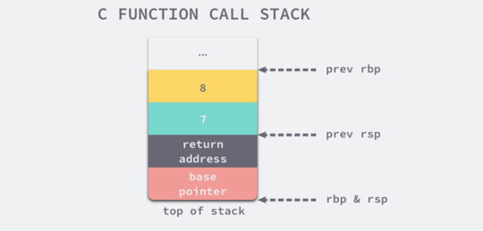

___# 1. 函数
定义形式：
```
// 具名函数
func Add(a, b int) int {
    return a+b
}

// 匿名函数
var Add = func(a, b int) int {
    return a+b
}

// 结构方法
// 关闭文件
func (f *File) CloseFile() error {
    // ...
}

// 读文件数据
func (f *File) ReadFile(offset int64, data []byte) int {
    // ...
}
```

## 1.1 函数调用过程
### 1.1.1 C中函数调用过程
C/C++中，调用函数时，前六个参数会使用 edi、esi、edx、ecx、r8d 和 r9d 六个寄存器传递。寄存器的使用顺序也是调用惯例的一部分，函数的第一个参数一定会使用 edi 寄存器，第二个参数使用 esi 寄存器，以此类推。

```
int my_function(int arg1, int arg2, int ... arg8) {
    return arg1 + arg2 + ... + arg8;
}
```
如上述代码所示，当 my_function 函数的入参增加至八个时，重新编译当前程序可以会得到不同的汇编代码：
```
main:
	pushq	%rbp
	movq	%rsp, %rbp
	subq	$16, %rsp     // 为参数传递申请 16 字节的栈空间
	movl	$8, 8(%rsp)   // 传递第 8 个参数
	movl	$7, (%rsp)    // 传递第 7 个参数
	movl	$6, %r9d
	movl	$5, %r8d
	movl	$4, %ecx
	movl	$3, %edx
	movl	$2, %esi
	movl	$1, %edi
	call	my_function
```
main 函数调用 my_function 时，前六个参数会使用 edi、esi、edx、ecx、r8d 和 r9d 六个寄存器传递。寄存器的使用顺序也是调用惯例的一部分，函数的第一个参数一定会使用 edi 寄存器，第二个参数使用 esi 寄存器，以此类推。


最后的两个参数与前面的完全不同，调用方 main 函数通过栈传递这两个参数，下图展示了 main 函数在调用 my_function 前的栈信息：


- 上图中 rbp 寄存器会存储函数调用栈的基址指针，即属于 main 函数的栈空间的起始位置，而另一个寄存器 rsp 存储的是 main 函数调用栈结束的位置，这两个寄存器共同表示了函数的栈空间。
- 六个以及六个以下的参数会按照顺序分别使用 edi、esi、edx、ecx、r8d 和 r9d 六个寄存器传递；
- 六个以上的参数会使用栈传递，函数的参数会以从右到左的顺序依次存入栈中；
- 而函数的返回值是通过 eax 寄存器进行传递的，由于只使用一个寄存器存储返回值，所以 C 语言的函数不能同时返回多个值。

### 1.1.2 Go中的函数调用过程
```go
package main

func myFunction(a, b int) (int, int) {
	return a + b, a - b
}

func main() {
	myFunction(66, 77)
}
```
上述的 myFunction 函数接受两个整数并返回两个整数，main 函数在调用 myFunction 时将 66 和 77 两个参数传递到当前函数中，使用 ``go tool compile -S -N -l main.go`` 编译上述代码可以得到如下所示的汇编指令：
```
"".main STEXT size=68 args=0x0 locals=0x28
	0x0000 00000 (main.go:7)	MOVQ	(TLS), CX
	0x0009 00009 (main.go:7)	CMPQ	SP, 16(CX)
	0x000d 00013 (main.go:7)	JLS	61
	0x000f 00015 (main.go:7)	SUBQ	$40, SP      // 分配 40 字节栈空间
	0x0013 00019 (main.go:7)	MOVQ	BP, 32(SP)   // 将基址指针存储到栈上
	0x0018 00024 (main.go:7)	LEAQ	32(SP), BP
	0x001d 00029 (main.go:8)	MOVQ	$66, (SP)    // 第一个参数
	0x0025 00037 (main.go:8)	MOVQ	$77, 8(SP)   // 第二个参数
	0x002e 00046 (main.go:8)	CALL	"".myFunction(SB)
	0x0033 00051 (main.go:9)	MOVQ	32(SP), BP
	0x0038 00056 (main.go:9)	ADDQ	$40, SP
	0x003c 00060 (main.go:9)	RET
```
可得到下图：


|空间	|大小 |	作用 |
| --- | --- | --- |
|SP+32 ~ BP |	8 字节	 | main 函数的栈基址指针 |
|SP+16 ~ SP+32 |	16 字节	| 函数 myFunction 的两个返回值 |
|SP ~ SP+16 |	16 字节	| 函数 myFunction 的两个参数 |

所以，Golang在调用函数前，会预先分配接收返回值的地址，传入参数也都是通过栈传递实现

### 对比
C 语言和 Go 语言在设计函数的调用惯例时选择了不同的实现。C 语言同时使用寄存器和栈传递参数，使用 eax 寄存器传递返回值；而 Go 语言使用栈传递参数和返回值。我们可以对比一下这两种设计的优点和缺点：

- C 语言的方式能够极大地减少函数调用的额外开销，但是也增加了实现的复杂度；
  + CPU 访问栈的开销比访问寄存器高几十倍3；
  + 需要单独处理函数参数过多的情况；
- Go 语言的方式能够降低实现的复杂度并支持多返回值，但是牺牲了函数调用的性能；
  + 不需要考虑超过寄存器数量的参数应该如何传递；
  + 不需要考虑不同架构上的寄存器差异；
  + 函数入参和出参的内存空间需要在栈上进行分配；

## 1.2 参数传递
### 1.2.1 整型和数组
```
func myFunction(i int, arr [2]int) {
    i = 29
	arr[1] = 88
	fmt.Printf("in my_funciton - i=(%d, %p) arr=(%v, %p)\n", i, &i, arr, &arr)
}

func main() {
	i := 30
	arr := [2]int{66, 77}
	fmt.Printf("before calling - i=(%d, %p) arr=(%v, %p)\n", i, &i, arr, &arr)
	myFunction(i, arr)
	fmt.Printf("after  calling - i=(%d, %p) arr=(%v, %p)\n", i, &i, arr, &arr)
}

$ go run main.go
before calling - i=(30, 0xc000072008) arr=([66 77], 0xc000072010)
in my_funciton - i=(29, 0xc000072028) arr=([66 88], 0xc000072040)
after  calling - i=(30, 0xc000072008) arr=([66 77], 0xc000072010)
```
**Golang中整型和数组都是通过值传递**，在调用的过程中，会产生拷贝。

### 1.2.2 结构体和指针
```
type MyStruct struct {
	i int
}

func myFunction(a MyStruct, b *MyStruct) {
	a.i = 31
	b.i = 41
	fmt.Printf("in my_function - a=(%d, %p) b=(%v, %p)\n", a, &a, b, &b)
}

func main() {
	a := MyStruct{i: 30}
	b := &MyStruct{i: 40}
	fmt.Printf("before calling - a=(%d, %p) b=(%v, %p)\n", a, &a, b, &b)
	myFunction(a, b)
	fmt.Printf("after calling  - a=(%d, %p) b=(%v, %p)\n", a, &a, b, &b)
}

$ go run main.go
before calling - a=({30}, 0xc000018178) b=(&{40}, 0xc00000c028)
in my_function - a=({31}, 0xc000018198) b=(&{41}, 0xc00000c038)
after calling  - a=({30}, 0xc000018178) b=(&{41}, 0xc00000c028)
```
从上述运行的结果我们可以得出如下结论：
- 传递结构体时：会拷贝结构体中的全部内容；
- 传递结构体指针时：会拷贝结构体指针；也就是调用后，会有两个指针指向同一个地方___

### 小结
在Golang中，传递参数和返回值是通过栈传递，在调用函数前会预先分配好返回对象的内存空间，随后将入参值从右至左的压栈。

1. 通过堆栈传递参数，入栈的顺序是从右到左，而参数的计算是从左到右；
2. 函数返回值通过堆栈传递并由调用者预先分配内存空间；
3. 调用函数时都是传值，接收方会对入参进行复制再计算；

# 2. 接口
